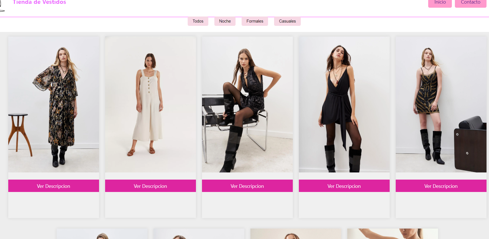
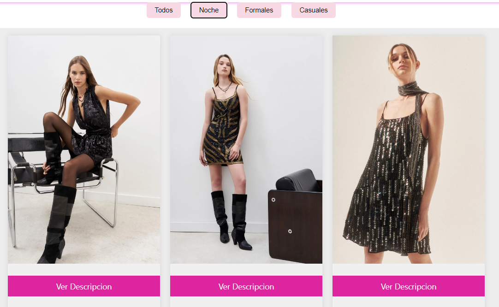
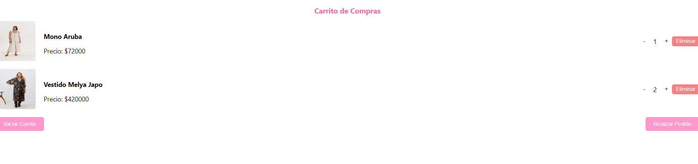
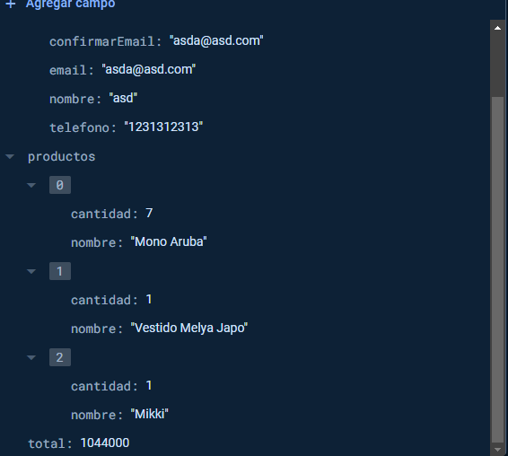
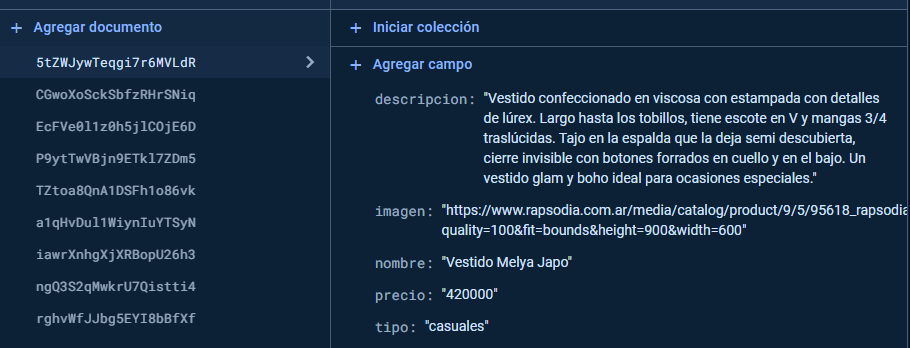

# Proyecto Final Coder House Tienda de Vestidos

Curso: React / Coderhouse 54020

## Fundamentación

El proyecto surge como propuesta de renovación del e-commerce de una tienda de vestidos. El trabajo busca lograr el mejor diseño de la interfaz como para la experiencia de usuario al realizar una compra.

## Tecnologías
HTML5
CSS3
JavaScript

## Librerías
Node.js
React

## Base de datos
Firestore

## Gestor de paquetes

npm

## Control de versiones

git

En el directorio del proyecto se debe ingresar en la consola:
npm start

De esta forma se inicia en forma local y se puede acceder en http://localhost:3000 para verlo en el navegador.

## Vista general del home  

## Clasificacion por tipo de prenda

## carrito de compras

## Checkout 

(image-3.png)

### Datos de los pedidos en firebase

### Productos en firebase

